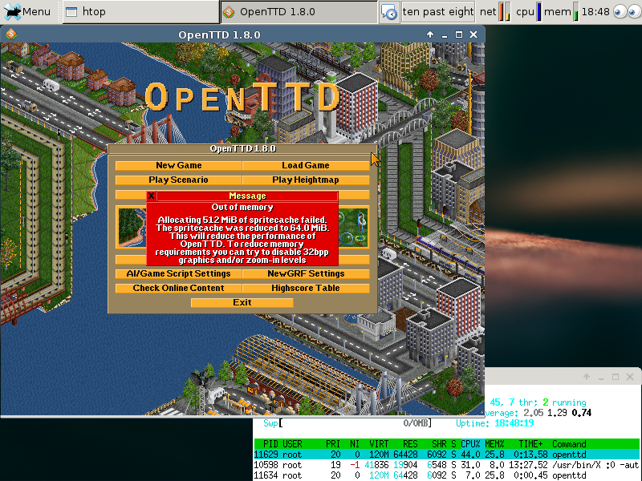

# meta-openttd

OpenTTD is a clone of Transport Tycoon Deluxe, a popular game originally
written by Chris Sawyer.  It attempts to mimic the original game as closely
as possible while extending it with new features.

OpenTTD for OpenEmbedded/Yocto. Based on the [oe-classic
recipe](http://cgit.openembedded.org/openembedded/tree/recipes/openttd/openttd_0.7.4.bb),
modernized  to OpenTTD 1.0.0 and 1.8.0, tested on  yocto 1.4 / Dylan. Version
1.0.0 performs best, 1.8.0 is the last version I can compile due to an older
GCC version on my board-specific cross-compile toolset (gcc 4.7.1).

Included in this repo is the source code for OpenTTD, OpenGFX and OpenSFX.
Also included is a recipe for `libsdl-net` ([via](https://github.com/geoffrey-vl/meta-doom)). 

Author: Remy van Elst - https://raymii.org

## Screenshots 

Screenshots are taken on a VAR-SOM-AM33 board with x11/xfce running.

OpenTTD 1.0.0 with opensfx/opengfx 0.1.0:

OpenTTD 1.8.0 with opensfx 1.0.1 and opengfx 0.6.1:

Another screenshot of OpenTTD 1.8.0:

## Licenses

Bitbake recipes are licensed under GNU GPLv2.

### OpenTTD

OpenTTD is licensed under the GNU General Public License version 2.0. 

### OpenGFX

OpenGFX Graphics Base Set for OpenTTD Copyright © 2007-2016 by the OpenGFX
team.  This program is free software; you can redistribute it and/or modify it
under the terms of the GNU General Public License version 2 as published by
the Free Software Foundation. 

### OpenSFX 

The OpenSFX sounds are licensed under the Creative Commons
Attribution-ShareAlike 3.0 Unported license.

All other files, including text files, scripts, etc. are dual-licensed under:
GNU General Public License version 2 (or later) and Common Development and
Distribution License 1.1.

## Adding the meta-openttd layer to your build

In order to use this layer, you need to make the build system aware of
it.

Assuming the meta-openttd layer exists at the top-level of your
yocto build tree, you can add it to the build system by adding the
location of the meta-openttd layer to bblayers.conf, along with any
other layers needed. e.g.:

    BBLAYERS ?= " \
      /path/to/yocto/meta \
      /path/to/yocto/meta-poky \
      /path/to/yocto/meta-yocto-bsp \
      /path/to/yocto/meta-meta-openttd \
      "

